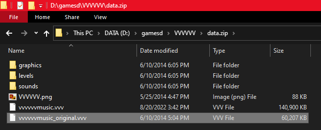

# VVVVVV SiIvagunner Mod

This mod adds all the SiIvagunner and Timmy Turner's Grand Dad Song Parodies to VVVVVV.

## How to Install

1. Open your VVVVVV game folder and unzip `data.zip` into a new folder.
2. (Make sure you have activated `Show filename extensions` in Windows Explorer.) Rename `data.zip` (e. g. to `data_original.zip`) and name the folder you have unzipped in step 1 `data.zip` (the game will only be able to find the assets if the folder has this exact name.)
3. Open this new `data.zip` folder and rename the file `vvvvvvmusic.vvv` (e. g. to `vvvvvvmusic_original.vvv`).
4. Download [the latest release]() and place the `vvvvvvmusic.vvv` into the `data.zip` folder. If you did everything right, your folder should look like this: 

Enjoy! You should hear the high-quality music right on the title menu. 

If the File extensions don't show up, you have to set this checkmark in Windows Explorer:

!{}(./explorer_show_file_name_extensions.png)
