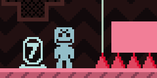

# VVVVVV SiIvagunner Mod

This mod adds all the SiIvagunner and Timmy Turner's Grand Dad Song Parodies to VVVVVV. Works both with the commercial and the [free](https://thelettervsixtim.es/makeandplay/) version.

## How to Install

1. Find VVVVVV's customization folder. The easiest way to do this is to open the game go to "levels", then select "open level folder", and go up one subfolder to VVVVVV/ (this folder should be `%USERPROFILE%\Documents\VVVVVV\` on Windows). 
2. Download [the latest release](https://github.com/perguto/VVVVVV-SiIvagunner-Mod/releases), unzip it and unzip the `data.zip` folder into the `VVVVVV` directory. If you did everything right, your folder should look like this:
   

If you did everything right, you should be greeted by some high quality music in the first 10 seconds of starting the game :]
